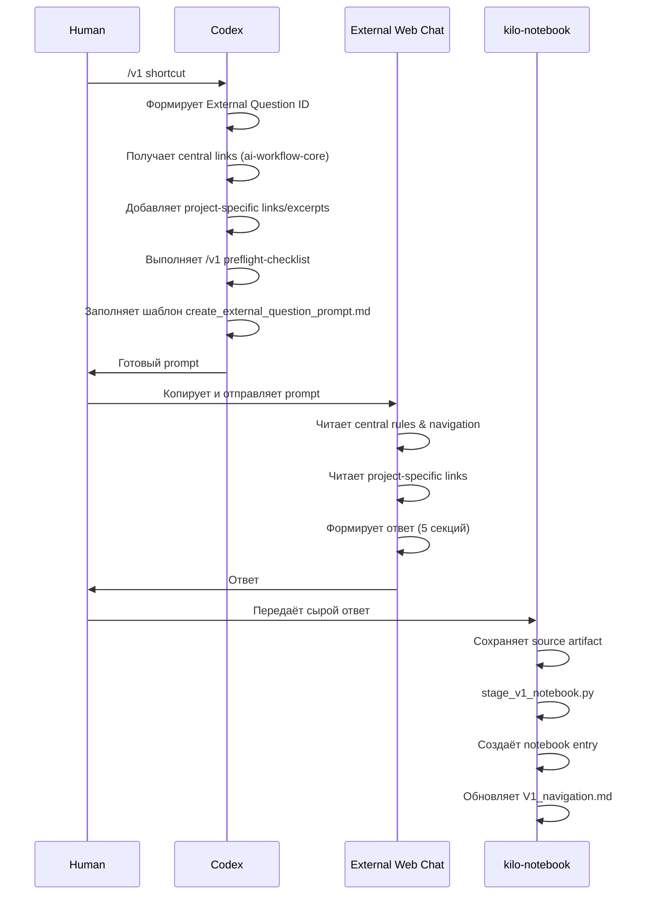
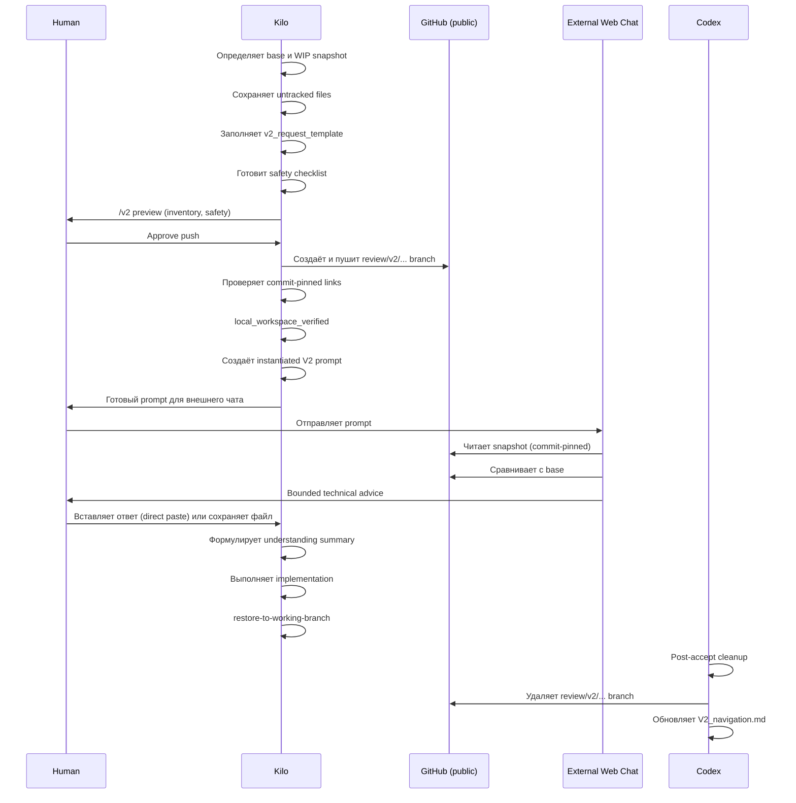
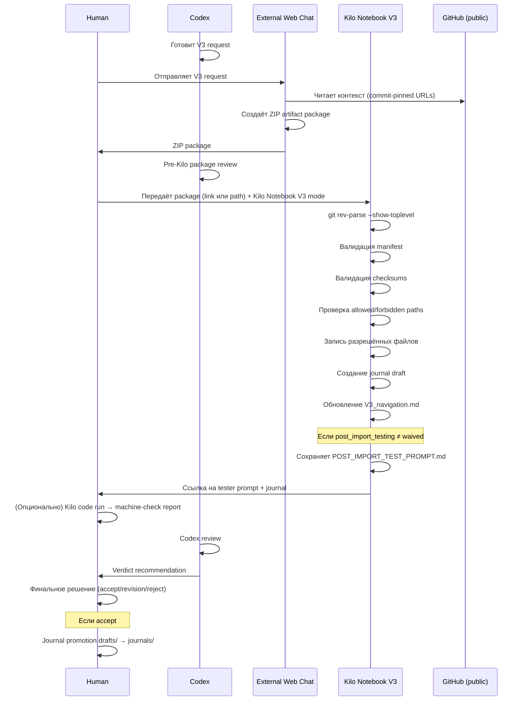

# Отчёт по внешним external chat workflow: V1, V2, V3

**REPORT_MARKER: EXTERNAL-CHAT-WORKFLOWS-2026-06-26**

**Дата:** 2026-06-26
**Источник:** Репозиторий `sword-of-rome-web` (AndrewVerhoturov1/Sword_of_rome_2d)
**Метод:** Исследование репозитория через OpenCode (чтение AGENTS.md, .ai/external_chats/, .ai/external_reviews/, .ai/v3/, scripts/, prompts/, contracts/, templates/, navigation-файлов)
**Объём отчёта:** Полное документирование трёх маршрутов внешнего взаимодействия

---

## 1. Executive summary

В репозитории `sword-of-rome-web` реализована система из трёх маршрутов внешнего взаимодействия (external chat workflows), которые позволяют привлекать внешние AI-чаты (ChatGPT, DeepSeek и др.) для bounded задач без предоставления прямого доступа к локальному репозиторию.

**V1 — Prompt-only маршрут.** Лёгкий путь: Codex готовит текст вопроса, человек копирует его во внешний чат, получает ответ. Ответ сохраняется локально через `kilo-notebook` (staged entry). Никаких handoff, пакетов, публикаций. Это default external route.

**V2 — External Senior Review.** Тяжёлый ручной протокол для bounded technical review реального WIP-кода. Kilo готовит snapshot в отдельной `review/v2/...` ветке, пушит её в GitHub после явного разрешения человека, готовит prompt с commit-pinned ссылками. Внешний чат видит зафиксированный код и diff. Ответ ingest-ится вручную (прямая вставка или локальный файл).

**V3 — Artifact-Producing Workflow.** Внешний чат создаёт ZIP artifact package со строгой структурой (manifest, checksums, control files, project files). Пакет проходит pre-Kilo review, затем `Kilo Notebook V3` импортирует его — проверяет manifest, checksums, пути, записывает разрешённые файлы, создаёт journal draft. После импорта — post-import testing (опционально), Codex review, human verdict.

Все три маршрута разделяют общие принципы: внешний чат не имеет repo authority; любой ответ — planning/debug input, а не accepted fact; финальное решение остаётся за человеком; локальная верификация Codex обязательна.

---

## 2. Terminology and entities

### Основные сущности

| Термин | Описание |
|--------|----------|
| **External Web Chat** | Внешний AI-чат (ChatGPT, DeepSeek и др.) без доступа к файловой системе репозитория. Agent kind, не Kilo mode. |
| **Codex** | Оркестратор: изучает контекст, планирует, готовит handoff, проверяет report и diff. |
| **Kilo Code** | Исполнитель изолированных задач. Несколько режимов: `kilo-handoff-runner`, `kilo-debugger`, `kilo-verifier`, `kilo-recorder`, `kilo-notebook`, `kilo-notebook-v3`. |
| **Human Master / Человек** | Управляет публикацией, объёмом раскрываемого контекста и финальными решениями. |
| **Planner** | Готовит и поддерживает documentation-driven подпроекты. |
| **Orc** | Главный исполнительный чат для подпроекта. Вызывает Kilo, V1, V2, V3 как инструменты. |

### Артефакты

| Термин | Описание |
|--------|----------|
| **External launch package** | Пакет, который Codex готовит для External Web Chat (маршрут `/r1`). Содержит published-artifact ссылки, static manual version, task bundle, expected response path. |
| **Recorder package** | Пакет для `kilo-recorder`. Содержит target metadata и raw external response. Не reasoning step. |
| **Notebook package** | Пакет для `kilo-notebook`. Содержит raw_response, external_question_id, пути. |
| **V2 snapshot** | Зафиксированный WIP-код в отдельной `review/v2/...` ветке на GitHub для внешнего review. |
| **V3 artifact package** | ZIP-архив со строгой структурой: manifest.yaml, README_FOR_KILO.md, README_FOR_CODEX.md, checksums.sha256, files/. |

### Маршруты

| Команда | Полное имя | Назначение |
|---------|-----------|------------|
| `/v1`, `/V1`, `/в1`, `/В1` | V1 prompt-only | Prompt-only вопрос во внешний чат. Default external route. |
| `/v2` | V2 External Senior Review | Bounded technical review зафиксированного WIP-снапшота. |
| `/v3`, `/V3`, `/в3`, `/В3` | V3 import-entry | Import-entry route для уже существующего V3 artifact package. |
| `/r1`, `/р1` | R1 full external launch | Полный published-artifact маршрут (редкий advanced/manual-only). |
| `/k1`, `/к1` | K1 handoff prep | Подготовка Kilo handoff. |

---

## 3. Shared architecture and invariants

### Принципы, общие для всех трёх маршрутов

1. **External Web Chat не является authority по локальному репозиторию.** Он работает только с данными, явно переданными в prompt: central ссылки, project-specific ссылки, excerpts, имена файлов.
2. **Ответ внешнего чата — planning/debug input, а не accepted fact.** Любые выводы требуют локальной проверки Kilo/Codex перед использованием.
3. **Финальное решение остаётся за человеком.** Codex может рекомендовать, но не заменяет human verdict.
4. **Локальная верификация обязательна.** External Web Chat не является источником фактов о repo без локальной проверки Codex.
5. **Человек вручную переносит handoff, report и diff между Codex, Kilo Code и VS Code.**
6. **Ни один маршрут не даёт внешнему чату права утверждать, что он видел git status, diff, тесты или runtime.**
7. **Все маршруты используют два слоя контекста:** central core (`ai-workflow-core`) и consumer repo (`sword-of-rome-web`).

### Agent-first execution mandate

Worker Codex не является исполнителем по умолчанию. Содержательное выполнение задач идёт через агентов: `Kilo Code` и `External Web Chat`. При равной пригодности задачи небольшой приоритет у External Web Chat, кроме repo-authority/file-edit задач.

### Safety gates

- High-risk задачи проходят только через цепочку: Codex plan → Kilo small task → Codex review → human decision.
- YOLO Stop Gates: Kilo обязан остановиться при рискованных или бессмысленных действиях.
- Blocked statuses: `blocked-no-source-of-truth`, `blocked-needs-human-decision`, `blocked-v2-recommended`.
- Attempt budget: максимум 3 осмысленные попытки до blocked report.

---

## 4. Shared architecture and invariants (продолжение)

### Контракт ответа внешнего чата

Все маршруты требуют от внешнего чата обязательных секций ответа:

1. **External Question ID** (или V2 ID, V3 ID) — идентификатор ровно в том виде, в каком пришёл.
2. **Context Readback** — перечень всех документов, ссылок и excerpts с указанием статуса чтения: `fully read`, `partially read`, `not read`.
3. **Provider/Model** — провайдер и модель внешнего чата (или `not available`).
4. **Answer** — содержательный ответ.
5. **Candidate Navigation Entry** — короткая выжимка для будущей индексации.

Для вопросов про repo/workflow clarity ответ обязан разделять источники уверенности:
- `Confirmed from central docs`
- `Confirmed from provided excerpts`
- `Not available / not verified`

### Запреты (hard prohibitions)

Внешнему чату запрещено:
- Утверждать, что он видел локальный репозиторий, shell, git, тесты или runtime.
- Придумывать файлы, пути, коммиты, ветки, PR.
- Выдавать гипотезы и внешние знания за подтверждённые факты о локальном repo.
- Объявлять ответ accepted decision.
- Писать `fully read` для ссылки, которая не была открыта через инструмент.

---

## 5. Detailed V1 workflow

### Суть V1

V1 — это prompt-only маршрут. Codex готовит только текст вопроса (prompt), без handoff, без external launch package, без published task bundle, без Recorder Payload. Человек копирует prompt и отправляет во внешний чат вручную.

### Когда используется

- `/v1` — default external route, если достаточно одного prompt.
- Не нужен published task bundle, strict traceability, recorder-ready capture.
- Подходит для: brainstorming, critique, docs drafts, image generation, UX copy, plan review, prompt drafting, bounded second opinion.

### Полный lifecycle V1

```
1. Человек вводит `/v1` (shortcut)
2. Codex:
   a. Формирует External Question ID (формат: V1-YYYYMMDD-HHMMSS)
   b. Определяет вопрос
   c. Получает две обязательные central links:
      - external_chat_rules.md (raw URL из ai-workflow-core)
      - repo_navigation.md (raw URL из ai-workflow-core)
   d. Добавляет project-specific links/excerpts:
      - V1_navigation.md (если существует)
      - project-specific raw/blob URLs
      - excerpts из локальных файлов
   e. Выполняет /v1 preflight-checklist (6 пунктов)
   f. Использует обязательный шаблон prompts/create_external_question_prompt.md
   g. Пишет prompt в caveman-full стиле
3. Человек копирует prompt и отправляет во внешний чат
4. Внешний чат:
   a. Читает central rules (external_chat_rules.md)
   b. Читает central navigation (repo_navigation.md) — может переходить по ссылкам
   c. Читает project-specific links/excerpts
   d. Формирует ответ с пятью обязательными секциями
5. Человек получает ответ
6. Ответ сохраняется через kilо-notebook:
   a. Сырой ответ → source artifact (.ai/external_chats/notebook_sources/)
   b. python scripts/stage_v1_notebook.py --input <source-file>
   c. → notebook entry (.ai/external_chats/notebook/)
   d. → V1_navigation.md update
7. Codex может выполнить retrieval pre-check по External Question ID
```

### /v1 Preflight Checklist

До выдачи готового prompt пользователю Codex выполняет:

- [ ] Сформирован External Question ID формата `V1-YYYYMMDD-HHMMSS`.
- [ ] В prompt включены две обязательные central raw links (external_chat_rules.md и repo_navigation.md из ai-workflow-core).
- [ ] В prompt включены project-specific links/excerpts или явно указано `нет`/`отсутствуют`.
- [ ] В prompt явно затребованы пять обязательных секций ответа.
- [ ] Prompt не содержит требований Recorder Payload, published task bundle, handoff, external launch package.
- [ ] Prompt написан в стиле caveman full.

### /v1 Retrieval Pre-check

Если пользователь возвращается с External Question ID формата `V1-YYYYMMDD-HHMMSS`:

1. Сначала проверить `.ai/external_chats/V1_navigation.md`.
2. Если ID найден, открыть notebook entry по пути из индекса.
3. Только если ID не найден — сказать, что ответ не найден.

### V1 Runtime Binding

При явном shortcut `/v1` Codex **обязан** использовать шаблон `prompts/create_external_question_prompt.md` (или локальную копию `.ai/prompts/create_external_question_prompt.md`). Prompt, написанный вручную без шаблона, не считается готовым.

---

## 6. Detailed V2 workflow

### Суть V2

V2 — это строгий ручной протокол для внешнего senior review реального WIP-кода. В отличие от V1 (prompt-only), V2 даёт внешнему чату зафиксированный snapshot реального кода и контекст сравнения с base.

**Статус:** `hardened` — доработан после первого реального V2 pilot (0026).

### Когда используется V2

- Kilo достиг blocker на реальном WIP-коде → blocked-v2-recommended.
- Человек явно вызвал `/v2` как interrupt во время активного Kilo run.
- Нужен bounded technical advice по существующему коду.
- Проблема техническая (архитектура, баг, дизайн-решение), а не missing file/docs.

### Когда V2 НЕ нужен

- Отсутствует source of truth (файл, reference, правило).
- Проблема в private/local-only артефактах, которые нельзя публиковать.
- Acceptance criterion непроверяем до стадии review-worthy WIP.
- Проблема чисто организационная.

### Non-destructive V2 snapshot rule

**review/v2/... — это publication copy, not ownership transfer.**

После подготовки V2 snapshot должны быть выполнены оба условия:
1. Файлы доступны внешнему reviewer по commit-pinned GitHub-ссылкам.
2. Исходный локальный workspace всё ещё содержит нужное WIP-состояние.

**review/v2/... не может быть единственной оставшейся копией WIP.**

### Snapshot methods

| Метод | Статус | Описание |
|-------|--------|----------|
| `separate-worktree` | **preferred** | Snapshot в отдельном временном git worktree. Основной workspace не трогается. |
| `same-worktree-with-restore` | **fallback** | Snapshot в том же workspace с обязательным patch/backup restore после push. |

### V2 lifecycle (полная цепочка статусов)

```
draft
→ previewed
→ awaiting_human_push_approval
→ snapshot_pushed
→ local_workspace_verified
→ prompt_ready
→ waiting_external_answer
→ raw_response_captured
→ ingested
→ implementation_planned
→ implemented
→ cleaned / cleanup_pending / kept_by_decision
```

### Полный lifecycle V2

```
Фаза 1: Подготовка
  1. Kilo определяет base commit и WIP snapshot commit.
  2. Составляет inventory изменённых файлов.
  3. Корректно сохраняет untracked-файлы (git stash push --include-untracked).
  4. Заполняет v2_request_template.md.
  5. Готовит safety-отчёт по v2_safety_checklist.md.
  6. Показывает /v2 preview и ждёт human approval.

Фаза 2: Push (только после явного human approval)
  7. Kilo создаёт review branch (review/v2/YYYYMMDD-HHMMSS-short-topic).
  8. Коммитит snapshot и пушит в public GitHub.
  9. Проверяет commit-pinned ссылки.
  10. Финализирует request и safety artifacts.
  11. Выполняет local_workspace_verified gate.
  12. Создаёт instantiated V2 prompt с реальными commit-pinned ссылками.
  13. Показывает готовый prompt человеку.

Фаза 3: Внешний ответ
  14. Человек отправляет prompt во внешний чат.
  15. Внешний чат читает V2 request, открывает WIP files на snapshot commit,
      сравнивает с base, возвращает bounded technical advice.
  16. Человек получает ответ.

Фаза 4: Ingest
  17. Ручной ingest (два пути):
      a. Прямая вставка текста в ordinary Kilo run.
      b. Локально сохранённый V2 response file.
  18. Kilo формулирует understanding summary по v2_ingest_summary_template.md.

Фаза 5: Implementation
  19. Kilo выполняет изменения по мотивам review.
  20. Обязательный restore-to-working-branch step (если изменения были в review/v2/...).

Фаза 6: Cleanup
  21. Codex-owned post-accept cleanup:
      - Удаление local/remote review/v2/... branch.
      - Удаление temporary V2 runtime artifacts.
      - Обновление V2_navigation.md до cleaned.
  22. Или human override: kept_by_decision / cleanup_pending.
```

### V2 как interrupt

`/v2` может быть вызван пользователем во время уже идущего Kilo run. Контракт interrupt:

1. Kilo ставит обычную задачу на паузу.
2. Фиксирует текущее WIP state.
3. Переходит в `/v2 preview`.
4. После V2-цикла возвращается к исходной задаче (только после `local_workspace_verified`).

### V2 prompt — требования к внешнему чату

V2 prompt требует от внешнего чата:
1. Прочитать V2 request report первым.
2. Открыть WIP files на snapshot commit.
3. Сравнить их с base files на base commit.
4. Перечислить прочитанное в Context Readback.
5. Отделять verified facts от hypotheses.
6. Не утверждать, что видел local runtime, tests, shell или git status.
7. Давать bounded senior technical advice.
8. Явно говорить, чего не хватило.

### Обязательная форма ответа внешнего чата для V2

- V2 ID
- Context Readback
- Provider/Model
- Answer с подсекциями:
  - Confirmed from central docs
  - Confirmed from project docs
  - Confirmed from WIP snapshot
  - Confirmed from base comparison
  - Not available / not verified
  - Main assessment
  - Root cause hypothesis
  - Recommended correction path
  - Risks
  - Suggested implementation notes
  - Questions back to Kilo/user
- Candidate Navigation Entry

---

## 7. Detailed V3 workflow

### Суть V3

V3 — третий workflow route внешнего взаимодействия. Внешний чат не пишет файлы в репозиторий напрямую. Он готовит artifact package — ZIP-архив со строгой внутренней структурой. Дальше пакет проходит pre-Kilo review, импортируется через `Kilo Notebook V3`, проверяется Codex, и человек выносит вердикт.

**Текущий статус:** Phase 7 завершён. Режим `kilo-notebook-v3` canonically разрешён. `.ai/v3/` subsystem создана. `scripts/v3/*` helper layer существует. `/v3` shortcut активирован.

### Когда используется V3

- Нужно, чтобы внешний чат создал файлы (документацию, схемы, код) в строгом контролируемом процессе.
- V1 недостаточно (нужны файлы, а не только анализ), V2 избыточен (не нужен review WIP-кода).
- Требуется traceability: manifest, checksums, journal, review chain.

### Структура V3 artifact package

Корень ZIP обязан содержать строго:

```
V3-YYYYMMDD-HHMMSS-<slug>/
  manifest.yaml              # обязателен
  README_FOR_KILO.md         # обязателен (инструкция для импортёра)
  README_FOR_CODEX.md        # обязателен (инструкция для Codex)
  checksums.sha256           # обязателен
  POST_IMPORT_TEST_PROMPT.md # опционально (control file для post-import testing)
  files/                     # обязателен
    <project-relative-path-1>
    <project-relative-path-2>
    ...
```

**Инварианты пакета:**
- Manifest существует → иначе пакет невалиден.
- Все файлы из manifest есть в `files/`.
- Нет файлов в `files/` вне manifest.
- Все SHA-256 хэши совпадают с `checksums.sha256`.
- Все пути в `allowed_paths`, ни один не в `forbidden_paths`.

### Полный lifecycle V3

```
Фаза 0: Canonical разрешение режима
  - Режим kilo-notebook-v3 / Kilo Notebook V3 canonically разрешён в AGENTS.md,
    mode lists, правилах, validator. (Завершено)

Фаза 1: Foundation layer
  - Создан .ai/v3/ с README, V3_navigation. (Завершено)

Фаза 2: Contract pack
  - 9 контрактов: request, artifact package, manifest, journal,
    Codex review, revision, storage, scope, acceptance. (Завершено)

Фаза 3: Prompt/Template layer
  - 4 prompts: create V3 request, kilo-notebook-v3 mode, Codex review, revision request.
  - 5 templates: V3 request, manifest.yaml, journal, Codex review, revision request. (Завершено)

Фаза 4: Manual runtime readiness
  - Setup guide для ручной настройки режима. (Завершено)

Фаза 5: Safe Pilot (доказан двумя успешными import-циклами)
  5A - External Artifact Generation Pilot: внешний чат создаёт ZIP.
  5B - Pre-Kilo Package Review: Codex/человек проверяют ZIP.
  5C - Kilo Notebook V3 UI Setup: человек настраивает режим в UI.
  5D - Kilo Import Pilot: реальный import-run.

Фаза 6: Lifecycle hardening
  - Formalized closure rules, accepted journal policy, tester prompt, machine-check report. (Завершено)

Фаза 7: /v3 shortcut activation
  - /v3 shortcut активирован как explicit V3 import-entry mode.
  - scripts/v3/* helper layer создан.
  - auto-apply запрещён. (Завершено)
```

### V3 Import Flow (через Kilo Notebook V3)

```
1. Определить git repo root (git rev-parse --show-toplevel).
2. Получить raw input source пакета (archive link или local archive path).
3. Убедиться, что package доступен для чтения.
4. Проверить package root и обязательные control files.
5. Проверить manifest.yaml.
6. Проверить checksums.sha256.
7. Проверить allowed/forbidden paths.
8. Разрешить target paths только внутри найденного git repo root.
9. Записать только допустимые файлы.
10. Создать journal draft в .ai/v3/journals/drafts/.
11. Обновить V3_navigation.md.
12. Если post_import_testing.mode != waived и POST_IMPORT_TEST_PROMPT.md есть:
    - Сохранить verbatim-копию в .ai/v3/test_prompts/<V3-ID>_post_import_test_prompt.md.
    - Вернуть человеку кликабельную markdown-ссылку.
13. Вернуть список created/skipped files и путь к journal draft.
```

### V3 Post-import Testing

| mode | Семантика | POST_IMPORT_TEST_PROMPT.md |
|------|-----------|---------------------------|
| `required` | Тестирование обязательно | Должен быть в пакете → иначе blocked |
| `optional` | Prompt полезен, не блокирует | Опционален |
| `waived` | Тестирование не нужно | Не требуется |

### V3 Verdict Chain

```
imported != accepted

После импорта:
1. Tester prompt handoff → если mode != waived.
2. Machine-check report → обычный Kilo code run.
3. Human checks → человек выполняет вручную.
4. Codex review → читает journal, файлы, testing status.
5. Human verdict → accept / revision / reject.

После accept:
- Journal draft повышается из drafts/ в journals/.
- V3_navigation.md → accepted.
```

### V3 Scope Policy

| Scope | Default post_import_testing mode |
|-------|----------------------------------|
| `docs_only` | waived |
| `workflow_docs` | waived или optional |
| `schemas` | optional или required |
| `scripts` | required |
| `product_code` | required |

---

## 8. How external chat gets data/context

### Два слоя контекста

Все маршруты используют два слоя:

1. **Central core (ai-workflow-core):**
   - `external_chat_rules.md` — правила поведения внешнего чата (raw URL обязателен в каждом V1 prompt).
   - `repo_navigation.md` — справочник файлов central core (allowed navigation targets).

2. **Consumer repo (sword-of-rome-web):**
   - `V1_navigation.md` — индекс прошлых V1 ответов.
   - Project-specific raw/blob URLs на документы consumer repo.
   - Context excerpts из файлов, которые нельзя дать ссылками.

### V1: Prompt-only передача

Codex готовит один текст prompt, содержащий:
- External Question ID.
- Вопрос.
- Central links (две обязательные).
- Project-specific links/excerpts.
- V1_navigation.md (если существует).
- Требование пяти обязательных секций ответа.

Внешний чат читает ссылки через web tool, file reader, browser. Navigation traversal разрешён только по явно переданным ссылкам внутри `repo_navigation.md`.

### V2: Commit-pinned GitHub snapshot

- Kilo создаёт snapshot в `review/v2/...` branch и пушит в GitHub.
- Prompt содержит commit-pinned raw/blob URLs на snapshot files и compare link.
- Внешний чат открывает файлы по этим ссылкам, сравнивает с base.
- Не использует published-artifact route V1/R1.

### V3: GitHub-first external context mode

Prompt содержит буквальные commit-pinned GitHub raw URLs. Внешний чат читает контекст сам по этим ссылкам. Человек не обязан вручную прикладывать context files.

Markdown-ярлыки вида `[raw](...)` и `[blob](...)` НЕ используются в copy-paste prompt.

### Readback Honesty Policy

Для каждой ссылки в `Context Readback`:
- `fully read` — только если ссылка/файл реально открыт через инструмент.
- `partially read` — при частичном чтении или ограничениях.
- `not read` — если ссылка не открывалась, недоступна.

Запрещено писать `fully read` для ссылки, которая не была открыта через инструмент.

---

## 9. How external chat sees the repository

### Ограничения видимости

Внешний чат **никогда** не имеет:
- Прямого доступа к файловой системе репозитория.
- Доступа к git status, git diff, тестам, runtime.
- Доступа к локальным файлам вне переданных ссылок/excerpts.
- Доступа к private/local-only путям: `_local/`, `arena-prototype-launcher/`, `output/Arena tests/`, `.ai/handoffs/`, `.ai/reports/`, `.ai/plans/sessions/`.

### Что внешний чат видит

**V1:** Только то, что явно передано в prompt: central links, project-specific links/excerpts, V1_navigation.md.

**V2:** Commit-pinned snapshot на GitHub (review/v2/... branch), base commit для сравнения, V2 request report. Не видит локальные runtime artifacts (.ai/reports/, .ai/handoffs/, .ai/plans/sessions/).

**V3:** GitHub raw URLs на контекст consumer repo, V3 request. Не имеет прямого repo write access. Создаёт ZIP artifact package, а не делает прямой repo write.

### Navigation Traversal Policy (V1)

`repo_navigation.md` является allowed navigation target — внешний чат может переходить по ссылкам из этого файла. Правила:
- Может открывать релевантные вопросу ссылки.
- Не обязан читать все ссылки.
- Каждая открытая navigation-ссылка обязана попасть в Context Readback.
- Navigation даёт право переходить только по явно переданным ссылкам внутри `repo_navigation.md`.
- Не даёт права читать или утверждать что-либо о consumer repo без явно переданных project-specific links.

---

## 10. Temporary branches/worktrees/snapshots

### V1: Нет временных веток

V1 — prompt-only. Никаких временных веток, worktree или snapshot. Ответ сохраняется локально через `kilo-notebook`.

### V2: review/v2/... branch

- **Формат:** `review/v2/YYYYMMDD-HHMMSS-short-topic`
- **Repo:** `AndrewVerhoturov1/Sword_of_rome_2d`
- **Snapshot method preferred:** `separate-worktree`
- **Push gate:** Всегда human confirmation перед push.
- **Предупреждение:** Push в public GitHub = публикация. Даже после удаления ветки commit links могут остаться.
- **Immutable review target:** Snapshot Commit — ровно тот commit, который запушен и показан внешнему чату. Последующие implementation commits не заменяют его.

### V3: Staging zone (local-only)

- `.ai/v3/staging/` — import-stage tool, не обязательная human-обязанность до import-stage.
- ZIP может храниться локально (Downloads, local archive path) и review-иться без staging.
- Только после явного выбора repo-local staging fallback ZIP может быть сохранён в `.ai/v3/staging/`.
- `.ai/v3/staging/` не является canonical final storage для tester prompt copy.

### V3: Worktree не используется

V3 не использует git worktree. Import выполняется прямо в рабочую копию через `Kilo Notebook V3`. Journal draft и tester prompt создаются локально, без commit/push.

---

## 11. Context preparation and serialization

### V1: Serialization в prompt

1. Codex формирует External Question ID.
2. Получает central raw links (две обязательные).
3. Добавляет project-specific ссылки/excerpts.
4. Заполняет шаблон `create_external_question_prompt.md`.
5. Весь контекст сериализуется в один текст prompt.
6. Prompt передаётся человеку для ручного копирования во внешний чат.

### V2: Serialization через GitHub snapshot

1. Kilo определяет base commit и WIP snapshot.
2. Создаёт review branch и пушит snapshot.
3. Заполняет `v2_request_template.md` с метаданными.
4. Создаёт instantiated V2 prompt с commit-pinned ссылками.
5. Prompt содержит: V2 ID, base/snapshot commits, compare link, request report, safety checklist, конкретные WIP-файлы.
6. Prompt передаётся человеку для вставки во внешний чат.

### V3: Serialization через artifact package

1. Codex/человек готовит V3 request (структурированная постановка задачи).
2. Внешний чат создаёт ZIP artifact package с manifest, checksums, control files, files.
3. Пакет передаётся человеку (архив или ссылка).
4. Codex/человек выполняет pre-Kilo package review.
5. `Kilo Notebook V3` выполняет import с валидацией.
6. Journal draft создаётся как structured YAML.
7. Tester prompt (если режим не waived) сохраняется как verbatim-копия.

### Serialization constraints (общие)

- Local-only paths не сериализуются для внешнего чата.
- Raw URL preferred для чтения, blob URL — fallback/reference.
- Markdown-ярлыки не используются в copy-paste prompt для V3.
- Prompt пишется в caveman-full стиле для V1 (правило для Codex, не для внешнего чата).

---

## 12. Return transport into local repo workflow

### V1: Через kilo-notebook

```
Внешний чат → сырой ответ (text)
  → человек копирует ответ
  → source artifact (.ai/external_chats/notebook_sources/)
  → python scripts/stage_v1_notebook.py --input <source-file>
  → internal notebook package
  → notebook entry (.ai/external_chats/notebook/)
  → V1_navigation.md update
```

**Kilo-notebook** (не kilo-recorder) используется для V1 staged local persistence. Это не reasoning/review step — notebook пишет только разрешённые файлы (notebook entry + V1_navigation.md).

### V2: Ручной ingest (два пути)

**Path A — прямая вставка:**
```
Внешний чат → сырой ответ
  → человек копирует ответ и вставляет в ordinary Kilo run
  → Kilo читает ответ и формулирует understanding summary
    по v2_ingest_summary_template.md
  → ingest summary (.ai/external_reviews/ingest_summaries/)
  → Kilo выполняет implementation по мотивам review
  → review/v2/... cleanup (Codex-owned)
```

**Path B — локальный response-файл:**
```
Внешний чат → сырой ответ
  → человек сохраняет в .ai/external_reviews/responses/
    по v2_response_template.md
  → ordinary Kilo run читает файл и формулирует understanding summary
  → ingest summary (.ai/external_reviews/ingest_summaries/)
  → implementation → cleanup
```

V2 ingest не использует `kilo-recorder`. `kilo-notebook` остаётся `/v1-only`.

### V3: Через Kilo Notebook V3

```
Внешний чат → ZIP artifact package
  → человек получает пакет (скачивает архив или получает ссылку)
  → pre-Kilo package review (Codex/человек)
  → Kilo Notebook V3 import:
      - validate manifest, checksums, paths
      - write allowed files
      - create journal draft (.ai/v3/journals/drafts/)
      - update V3_navigation.md
      - save tester prompt (если нужно)
  → post-import testing (опционально)
  → Codex review
  → human verdict
  → accept → journal promotion из drafts/ в journals/
```

### Recorder package (для /r1, не для V1/V2/V3)

Для published-artifact route `/r1` используется `kilo-recorder`:
- Recorder package содержит: external_task_id, external_attempt_id, response_path, published_links, recording_mode, allowed_writes, raw_response.
- Kilo-recorder — execution sink: записывает response-файл verbatim, не интерпретирует, не review-ит.

---

## 13. Scripts/docs/contracts inventory with roles

### V1 Scripts

| Файл | Роль |
|------|------|
| `scripts/stage_v1_notebook.py` | Создание staged notebook entry из raw external response. Принимает `--input <source-file>`. |
| `scripts/write_v1_notebook.py` | Внутренний writer-step для создания notebook entry. Вызывается stage_v1_notebook.py. |

### V2 Templates

| Файл | Роль |
|------|------|
| `.ai/external_reviews/templates/v2_request_template.md` | Шаблон V2 request report. Содержит placeholders. |
| `.ai/external_reviews/templates/v2_prompt_template.md` | Шаблон V2 prompt для внешнего чата. Содержит placeholders. |
| `.ai/external_reviews/templates/v2_response_template.md` | Шаблон записи V2 response. |
| `.ai/external_reviews/templates/v2_ingest_summary_template.md` | Шаблон Kilo understanding summary после ingest. |
| `.ai/external_reviews/templates/v2_safety_checklist.md` | Safety checklist перед V2 push. |

### V3 Scripts

| Файл | Роль |
|------|------|
| `scripts/v3/validate_v3_package.py` | Read-only валидация структуры ZIP, manifest, checksums, paths. Ничего не меняет. |
| `scripts/v3/stage_v3_package.py` | Validate + extract в `.ai/v3/staging/<V3-ID>/` + staging report. Пишет только в staging. |
| `scripts/v3/write_v3_journal.py` | Создание draft journal в `.ai/v3/journals/drafts/`. Не трогает V3_navigation.md. |

### V3 Contracts (9 файлов)

| Файл | Роль |
|------|------|
| `.ai/v3/contracts/v3_request_contract.md` | Формальный контракт V3 request к внешнему чату. |
| `.ai/v3/contracts/v3_artifact_package_contract.md` | Структура ZIP artifact package. |
| `.ai/v3/contracts/v3_manifest_contract.md` | Контракт manifest.yaml. |
| `.ai/v3/contracts/v3_journal_contract.md` | Контракт journal entry. |
| `.ai/v3/contracts/v3_codex_review_contract.md` | Контракт Codex review после импорта. |
| `.ai/v3/contracts/v3_revision_contract.md` | Контракт revision loop. |
| `.ai/v3/contracts/v3_storage_policy.md` | Политика хранения артефактов. |
| `.ai/v3/contracts/v3_scope_policy.md` | Политика scope с post-import testing. |
| `.ai/v3/contracts/v3_acceptance_policy.md` | Правила acceptance/verdict. |

### V3 Prompts (4 файла)

| Файл | Роль |
|------|------|
| `.ai/v3/prompts/create_v3_request_prompt.md` | Как готовить V3 external request. |
| `.ai/v3/prompts/kilo_notebook_v3_mode_prompt.md` | Operating reference для Kilo Notebook V3. |
| `.ai/v3/prompts/codex_v3_review_prompt.md` | Как Codex проверяет imported result. |
| `.ai/v3/prompts/v3_revision_request_prompt.md` | Как запросить revision. |

### V3 Templates (5 файлов)

| Файл | Роль |
|------|------|
| `.ai/v3/templates/v3_request_template.md` | Шаблон V3 request. |
| `.ai/v3/templates/v3_manifest_template.yaml` | Шаблон manifest.yaml. |
| `.ai/v3/templates/v3_journal_template.yaml` | Шаблон journal. |
| `.ai/v3/templates/v3_codex_review_template.md` | Шаблон Codex review. |
| `.ai/v3/templates/v3_revision_request_template.md` | Шаблон revision request. |

### V3 Docs

| Файл | Роль |
|------|------|
| `.ai/v3/docs/manual_kilo_notebook_v3_setup.md` | Ручная настройка режима Kilo Notebook V3 в UI. |
| `.ai/v3/docs/phase5A_external_artifact_generation_pilot_detailed_implementation.md` | Импортированный док для Phase 5A. |
| `.ai/v3/docs/phase5B_pre_kilo_package_review_detailed_implementation.md` | Импортированный док для Phase 5B. |
| `.ai/v3/docs/phase5C_kilo_notebook_v3_ui_setup_detailed_implementation.md` | Импортированный док для Phase 5C. |

### External Chat Scripts

| Файл | Роль |
|------|------|
| `scripts/external_chat_publish.py` | Публикация artifacts для External Web Chat (published-artifact route /r1). |
| `scripts/validate_external_chat_package.py` | Валидация external chat package. |

### Navigation files

| Файл | Роль |
|------|------|
| `.ai/external_chats/V1_navigation.md` | Project-local индекс V1 entries. Первая точка поиска по External Question ID. |
| `.ai/external_reviews/V2_navigation.md` | Операционный lifecycle index V2 requests. |
| `.ai/v3/V3_navigation.md` | Lifecycle index V3 artifact-producing циклов. |

### Policy files

| Файл | Роль |
|------|------|
| `AGENTS.md` | Главный workflow contract. Содержит определения V1/V2/V3, recorder package, notebook package, safety gates, blocked statuses. |
| `.ai/policies/language_policy.md` | Политика языка: English идентификаторы, Russian UI/docs. |
| `.ai/policies/human_review_policy.md` | Политика human review. |
| `.ai/policies/bug_tracking_policy.md` | Политика bug tracking и bug journal. |

---

## 14. Mermaid sequence diagrams

### V1 — Prompt-only вопрос во внешний чат



### V2 — External Senior Review



### V3 — Artifact-Producing Workflow



---

## 15. Comparison table v1 vs v2 vs v3

| Критерий | V1 | V2 | V3 |
|----------|----|----|----|
| **Назначение** | Prompt-only вопрос | Senior review WIP-кода | Artifact-producing workflow |
| **Код виден внешнему чату?** | Нет (только описание) | Да (commit-pinned snapshot) | Да (через GitHub URLs) |
| **Артефакты** | Notebook entry | Review branch + V2 artifacts | ZIP package + journal |
| **Временные ветки?** | Нет | Да: `review/v2/...` | Нет (staging local-only) |
| **Human push gate?** | Нет | Да (обязательный) | Нет (кроме publish для external) |
| **Snapshot method** | N/A | separate-worktree (preferred) | N/A |
| **Post-import testing?** | Нет | Нет | Да (required/optional/waived) |
| **Ingest method** | kilo-notebook | Ручной (direct paste или файл) | Kilo Notebook V3 |
| **Git write actions?** | Нет | Push review branch | Нет |
| **Commit-pinned links?** | Опционально | Да (обязательно) | Да (для контекста) |
| **Context readback обязателен?** | Да | Да | Встроен в V3 request |
| **Provider/Model обязателен?** | Да | Да | Опционально |
| **Candidate Navigation Entry** | Да | Да | Встроен в journal |
| **Kilo mode** | kilo-notebook | kilo-handoff-runner / kilo-debugger | kilo-notebook-v3 |
| **Recorder used?** | Нет | Нет | Нет |
| **Codex review после?** | Нет (только pre-check) | Да (post-accept cleanup) | Да (обязателен) |
| **Human verdict после?** | Нет (только notebook) | Да (accept/reject) | Да (accept/revision/reject) |
| **Default для** | brainstorming, critique, docs | blocked-v2-recommended, interrupt | Создание файлов внешним чатом |
| **Статус реализации** | Production (много entries) | Hardened (5 реальных runs) | Phase 7 (много импортов) |
| **Сложность для человека** | Низкая | Высокая | Средняя |
| **Traceability** | Базовая (notebook) | Высокая (commit-pinned) | Очень высокая (manifest+checksums+journal) |

---

## 16. Risks, limitations, assumptions

### Риски

1. **V2 push = публикация.** Даже после удаления ветки commit links могут остаться во внешних чатах, кэше, форках. Если файл нельзя считать опубликованным, его нельзя пушить.
2. **External Web Chat не является authority.** Любой ответ может содержать hallucination, неверные предположения о repo, неполный анализ. Обязательна локальная проверка.
3. **V3: imported != accepted.** Импорт — только первый шаг. Полный review chain обязателен. Нельзя считать импортированные файлы финальным результатом.
4. **V3: ZIP без manifest** — не artifact package. Набор файлов в чате, не упакованный в ZIP, — не artifact package.
5. **Cross-repo root confusion.** Kilo Notebook V3 может записать файлы в неправильный repo root (например, в Documents вместо repo). Обязателен preflight `git rev-parse --show-toplevel`.
6. **V2 snapshot может потерять untracked files.** Без `git stash push --include-untracked` новые файлы будут потеряны при переключении на review-ветку.
7. **V2 lifecycle может застрять.** Push без последующего prompt_ready/waiting_external_answer — нарушение протокола.
8. **YOLO-режим не отменяет safety gates.** Push approval, local-only policy, human review gates действуют в любом режиме.

### Ограничения

1. **V1 не поддерживает Recorder Payload.** Ответ внешнего чата не идёт через kilo-recorder.
2. **V2 первая версия не содержит helper scripts.** Все команды — manual Kilo instructions.
3. **V3 MVP:** только `action: create` (новые файлы). Overwrite и delete не поддерживаются. Бинарные файлы не допускаются без явного разрешения.
4. **V3: `apply_v3_package.py` не создан.** Auto-apply запрещён. Manual flow остаётся primary.
5. **V2 не использует kilo-recorder.** Ingest полностью ручной.
6. **kilo-notebook остаётся /v1-only.** Не расширяется на V2 или V3.
7. **V3: setup guide существует, но режим может быть не настроен в UI.** Это нужно подтверждать отдельно.

### Assumptions

1. Человек имеет доступ к внешнему чату и может вручную копировать prompt/ответ.
2. GitHub публичный репозиторий доступен для внешнего чата (для V2 push, V3 GitHub-first context).
3. Внешний чат соблюдает контракт: возвращает обязательные секции, честный readback, разделение источников.
4. Kilo может выполнять git операции (stash, branch, commit, push, worktree).
5. Python 3.9+ и PyYAML доступны для V3 scripts.
6. Внешний чат может читать raw GitHub URLs и blob URLs.
7. git repo root определим через `git rev-parse --show-toplevel`.

---

## 17. Open questions

1. **V2 helper scripts:** Будет ли добавлена автоматизация V2 (commit/push/prompt generation) в будущем?
2. **V3 apply script:** Когда будет создан `apply_v3_package.py` или auto-apply останется запрещённым навсегда?
3. **V3 binary files:** Когда будет разрешён import бинарных файлов (изображения, assets)?
4. **V3 overwrite/delete:** Когда MVP расширится для поддержки overwrite и delete?
5. **V3 product_code scope:** Когда V3 будет использоваться для product-code (не только docs/workflow)?
6. **V1→V3 bridge:** Есть ли сценарий, где V1 ответ превращается в V3 package?
7. **V2 kilo-recorder integration:** Будет ли V2 когда-либо использовать kilo-recorder вместо ручного ingest?
8. **Cross-project portable package:** Как V1/V2/V3 контракты переносятся в новый проект через `.ai/bootstrap/portable/`?
9. **V3 acceptance rate:** Сколько V3 циклов было полностью завершено (accepted) vs остались в imported/pending?
10. **V3 post-import testing effectiveness:** Насколько эффективен machine-check report из ordinary Kilo code run?
11. **V2 remote cleanup:** Кто удаляет remote review branch, если Codex cleanup недоступен?
12. **V1/V2/V3 conflict resolution:** Что происходит, когда V2 review рекомендует изменения, конфликтующие с V3-импортированными файлами?

---

## 18. Evidence appendix with concrete file references

### Central core references (ai-workflow-core)

- `external_chat_rules.md` — `.ai/external_chats/external_chat_rules.md` (186 строк)
- `external_agent_static_manual.md` — `.ai/external_chats/external_agent_static_manual.md` (736 строк), версия `EA-STATIC-2026-05-14-V2`

### V1 key files

- `AGENTS.md` — секции: Short entry commands (/v1), /v1 Runtime Binding, /v1 Preflight Checklist, /v1 Retrieval Pre-check, /r1 Minimal Contract (строки 355-416)
- `prompts/create_external_question_prompt.md` — обязательный шаблон для /v1 (287 строк)
- `scripts/stage_v1_notebook.py` — создание notebook entry
- `scripts/write_v1_notebook.py` — writer-step notebook package
- `.ai/external_chats/V1_navigation.md` — 55 записей V1 entries
- `.ai/external_chats/notebook/` — директория notebook entries
- `.ai/external_chats/notebook_sources/` — source artifacts
- `.ai/external_chats/manual.md` — compact manual (261 строк)

### V2 key files

- `AGENTS.md` — секция: /v2 — External Senior Review (строки 445-478)
- `.ai/external_reviews/README.md` — протокол V2 External Senior Review (574 строк)
- `.ai/external_reviews/V2_navigation.md` — 5 записей V2 runs
- `.ai/external_reviews/templates/v2_request_template.md` — шаблон request
- `.ai/external_reviews/templates/v2_prompt_template.md` — шаблон prompt
- `.ai/external_reviews/templates/v2_response_template.md` — шаблон response
- `.ai/external_reviews/templates/v2_ingest_summary_template.md` — шаблон ingest summary
- `.ai/external_reviews/templates/v2_safety_checklist.md` — safety checklist
- `.ai/external_reviews/safety/` — safety reports
- `.ai/external_reviews/requests/` — request reports
- `.ai/external_reviews/prompts/` — instantiated prompts
- `.ai/external_reviews/responses/` — raw external answers
- `.ai/external_reviews/ingest_summaries/` — understanding summaries

### V3 key files

- `AGENTS.md` — секция: /v3 и /V3 (строки 421-443)
- `.ai/v3/README.md` — главный вход V3 (226 строк)
- `.ai/v3/V3_navigation.md` — 17 записей V3 циклов (158 строк)
- `.ai/v3/prompts/kilo_notebook_v3_mode_prompt.md` — operating reference (274 строк)
- `.ai/v3/prompts/create_v3_request_prompt.md` — создание V3 request
- `.ai/v3/prompts/codex_v3_review_prompt.md` — Codex review
- `.ai/v3/prompts/v3_revision_request_prompt.md` — revision request
- `.ai/v3/contracts/v3_request_contract.md` (170 строк)
- `.ai/v3/contracts/v3_artifact_package_contract.md` (270 строк)
- `.ai/v3/contracts/v3_acceptance_policy.md` (169 строк)
- `.ai/v3/contracts/v3_storage_policy.md` (206 строк)
- `.ai/v3/contracts/v3_manifest_contract.md`
- `.ai/v3/contracts/v3_journal_contract.md`
- `.ai/v3/contracts/v3_codex_review_contract.md`
- `.ai/v3/contracts/v3_revision_contract.md`
- `.ai/v3/contracts/v3_scope_policy.md`
- `.ai/v3/templates/v3_request_template.md`
- `.ai/v3/templates/v3_manifest_template.yaml`
- `.ai/v3/templates/v3_journal_template.yaml`
- `.ai/v3/templates/v3_codex_review_template.md`
- `.ai/v3/templates/v3_revision_request_template.md`
- `.ai/v3/docs/manual_kilo_notebook_v3_setup.md` (161 строк)
- `scripts/v3/validate_v3_package.py` — read-only валидатор
- `scripts/v3/stage_v3_package.py` — validate + extract
- `scripts/v3/write_v3_journal.py` — journal draft writer
- `scripts/v3/README.md` (37 строк)
- `prompts/create_v3_shortcut_prompt.md` — шаблон для /v3 shortcut (156 строк)

### General workflow files

- `AGENTS.md` — полный workflow contract (647 строк). Секции: Project context, Language Policy, Human Review, Bug Tracking, Codex+Kilo, Session contract, Model policy, Review/checkpoint, Launch package, Recorder package, Notebook package, Preflight publish check, Runtime metadata, Git truth, Agent-first, Short entry commands (/k1, /r1, /v1, /b1, /v3), /v2 protocol, Planner->Orc, Navigation boundaries, Safety gates, YOLO Stop Gates, Blocked statuses, Attempt budget, Blocked Report Contract.
- `.ai/repo_navigation.md` — справочник важных стабильных файлов (224 строк)
- `.ai/prompts/create_external_chat_request.md` — шаблон для /r1
- `.ai/external_chats/publisher_config.json` — конфигурация publisher (26 строк)
- `scripts/external_chat_publish.py` — публикация artifacts
- `scripts/validate_external_chat_package.py` — валидация external chat package
- `scripts/validate_kilo_contract.py` — валидация Kilo handoff
- `scripts/validate_session_contract.py` — валидация session contract

### V1/V2/V3 Navigation entries summary

- **V1_navigation.md:** 55 entries, все staged. Темы: audit, critique, planning, second opinion, architectural analysis, roadmap.
- **V2_navigation.md:** 5 entries: V2-20260526-140000 (cleaned), V2-20260526-174500 (implemented), V2-20260527-020100 (implemented), V2-20260527-151700 (cleaned), V2-20260527-172500 (implemented).
- **V3_navigation.md:** 17 entries. Статусы: imported (12), package_reviewed (2), request_prepared (1), и другие. Темы: doc packages, HTML pilots, master plans, migration plans.
